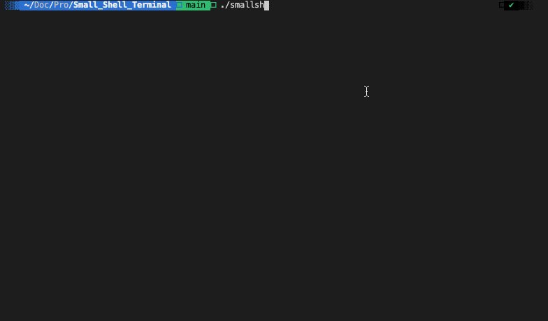

# Small Shell Terminal 

Instructions on how to compile the code for Small Shell Terminal:

Run this command to create an executable named movies:

gcc --std=gnu99 -g -Wall -o smallsh main.c

The ./smallsh executable can then be called and the command shell prompt will appear

Example:

./smallsh

---
## Video Walkthrough

Here's a walkthrough of program:

GIF created with [LiceCap](http://www.cockos.com/licecap/).
